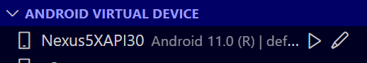
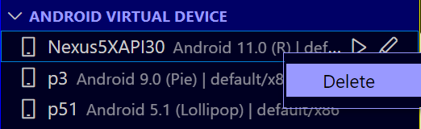
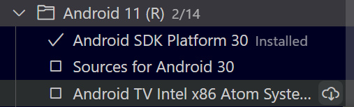
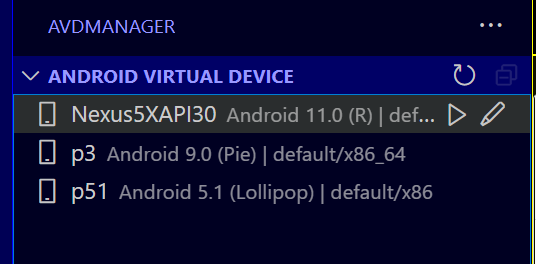
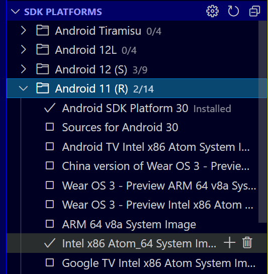

# Android Virtual Device (AVD) Manager

AVD Manager GUI for Visual Studio code.
Launch android emulator without touching the Android Studio😎.

See the [CHANGELOG](CHANGELOG.md) for the latest changes.

inspired by [oognuyh/vscode-android-emulator-helper](https://github.com/oognuyh/vscode-android-emulator-helper)

## Features

AVD Manager

* Create AVD (+ Button)
  
* Rename AVD [Pen Icon Button]
  
* Delete AVD [Right Click on AVD Name]
  
* AVD Details [Mouseover on the AVD name]
  

SDK Platforms

* Install packages (system-image, platforms, source-code)
  
* Accept SDK licenses [Gear Button]
  

Emulator

* Launch AVD [Play Button]
  

## Requirements

1. Download Android SDK Command-line Tools
   [https://developer.android.com/studio/command-line](https://developer.android.com/studio/command-line)
2. Download Emulator via cli tools
   ```bash
   sdkmanager emulator
   ```

## Extension Settings

* `avdmanager.avdmanager`: AVD Manager executable path
* `avdmanager.sdkManager`: SDK Manager executable path
* `avdmanager.emulator`: Android emulator executable path
* `avdmanager.emulatorOpt`: Android emulator execute [options](https://developer.android.com/studio/run/emulator-commandline)

## Screenshot

### AVD Manager



### SDK Platforms


